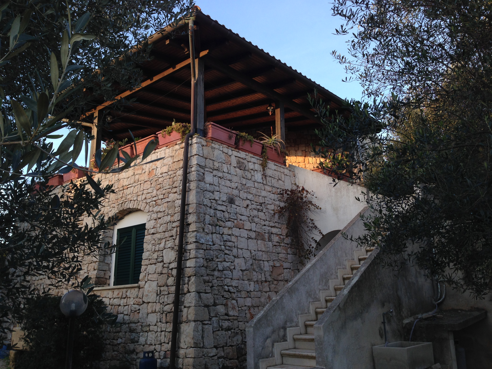
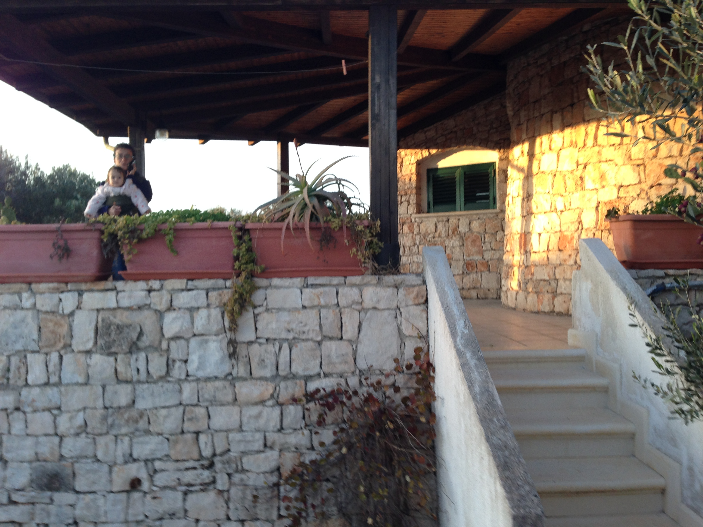
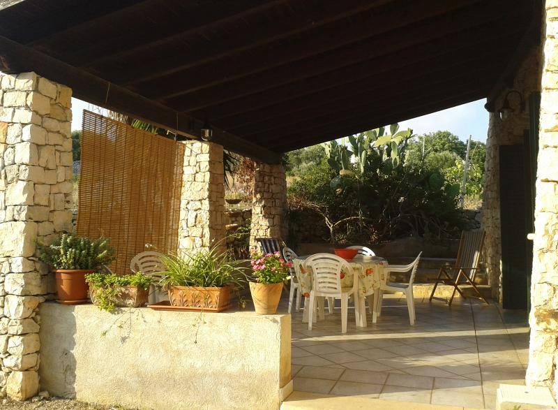
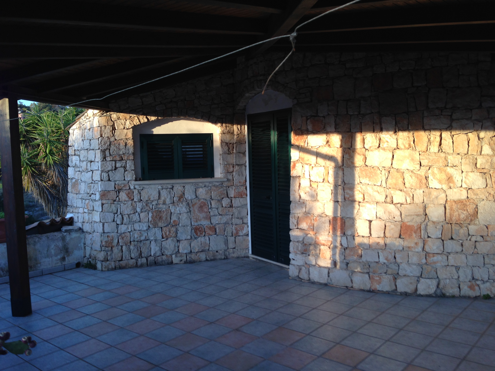
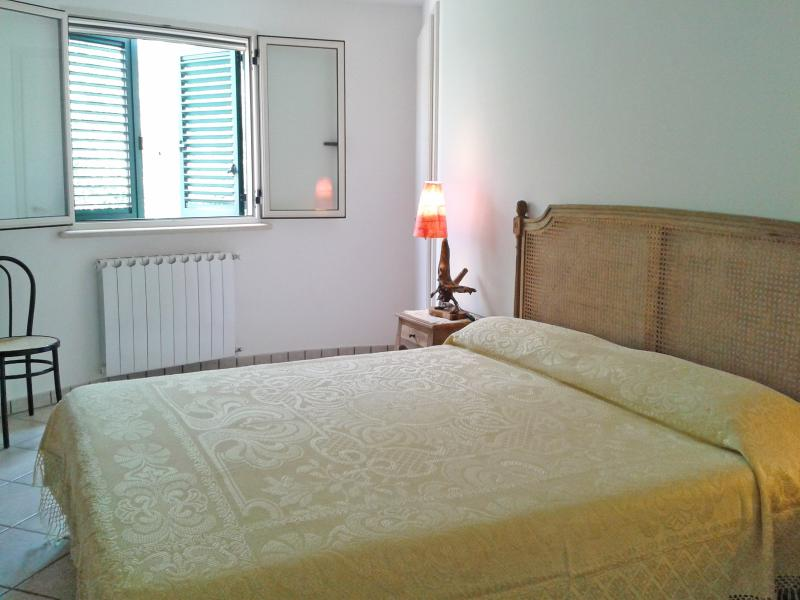

The first floor apartment is accessed via a separate external staircase to the right of the property. These open out onto a large terrace area which overlooks the bay of Felloniche. The terrace has a small table and chairs and benefits from full shade cover, which makes it ideal for watching the sun rise while eating your breakfast or watching it set while eating your supper. 

From the terrace, you enter the apartment into a small hallway, which leads into a compact but complete kitchenette with gas oven, hob and fridge. The main bedroom of the apartment is circular in design, formed by the traditional roundhouse building tecniques used in these 'Paiara' style houses. The bedroom has an ensuite bathroom with a toilet and shower. 

