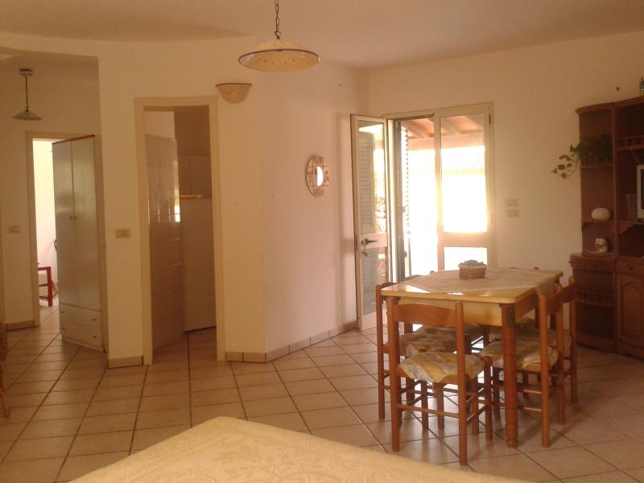
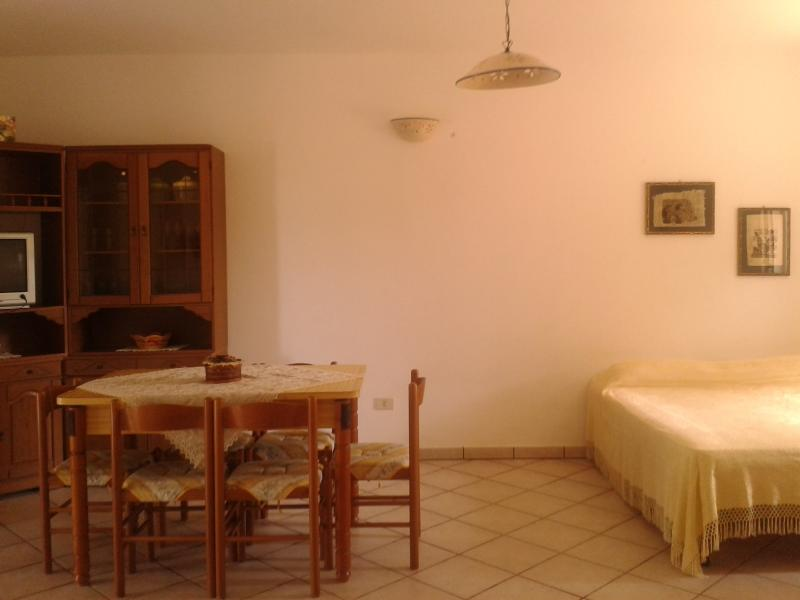
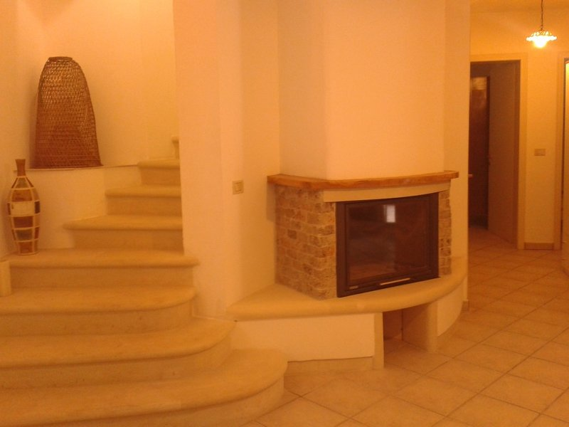
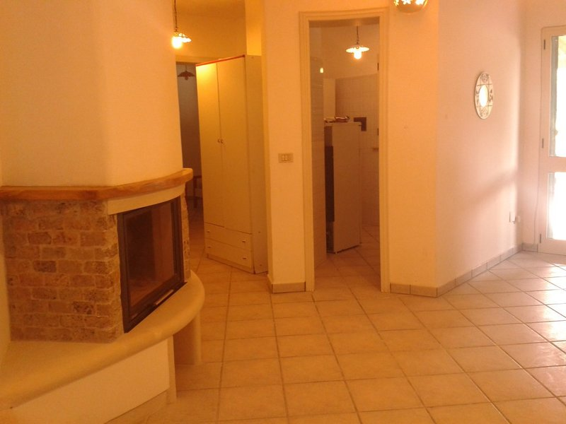
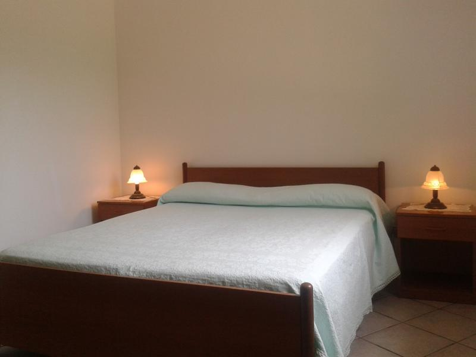
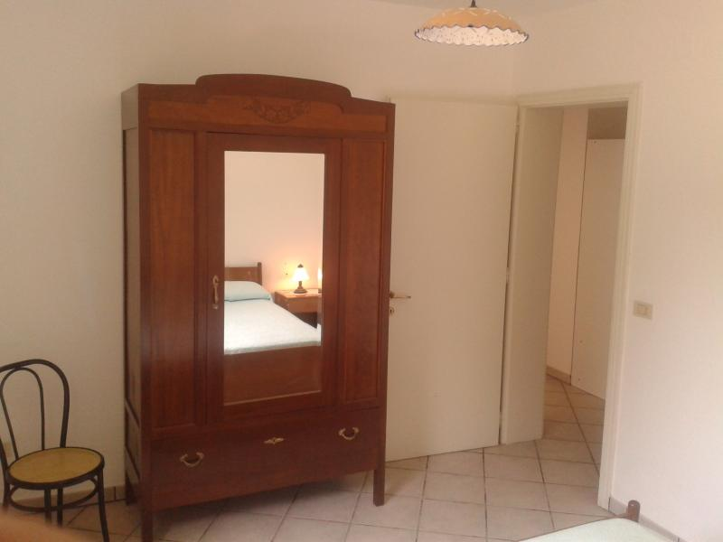
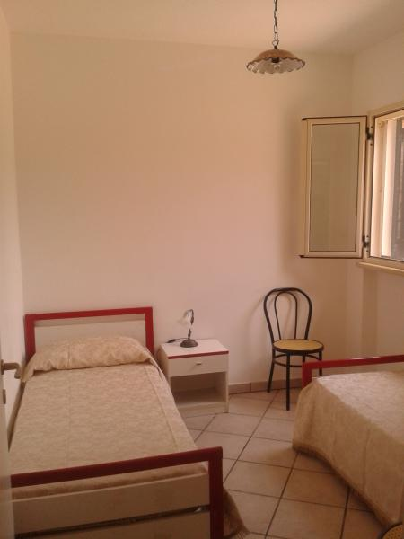
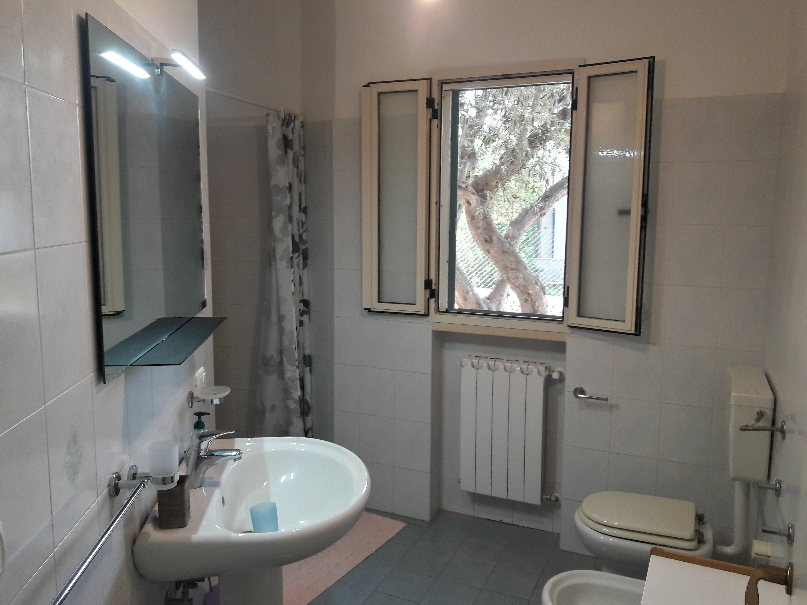
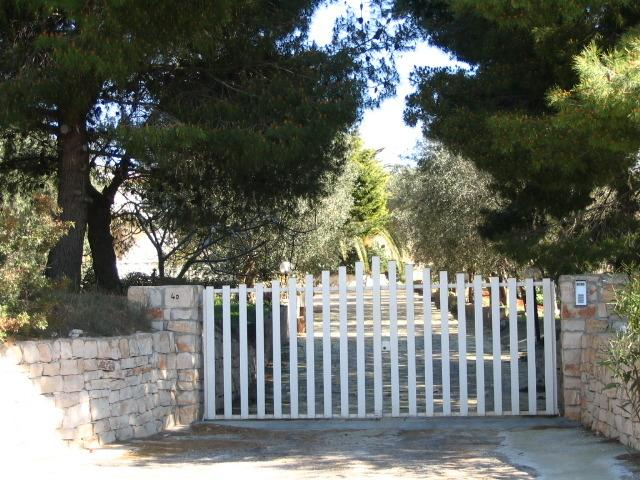

The ground floor apartment is accessed via the large terrace to the left of the property.

The accommodation comprises two bedrooms, bathroom, kitchen and generous lounge/dining area. The fireplace provides a central feature, which is built in the traditional style. 

Secure off-street parking provides easy access to and from the property as well as privacy. 

{:.image.centre}
