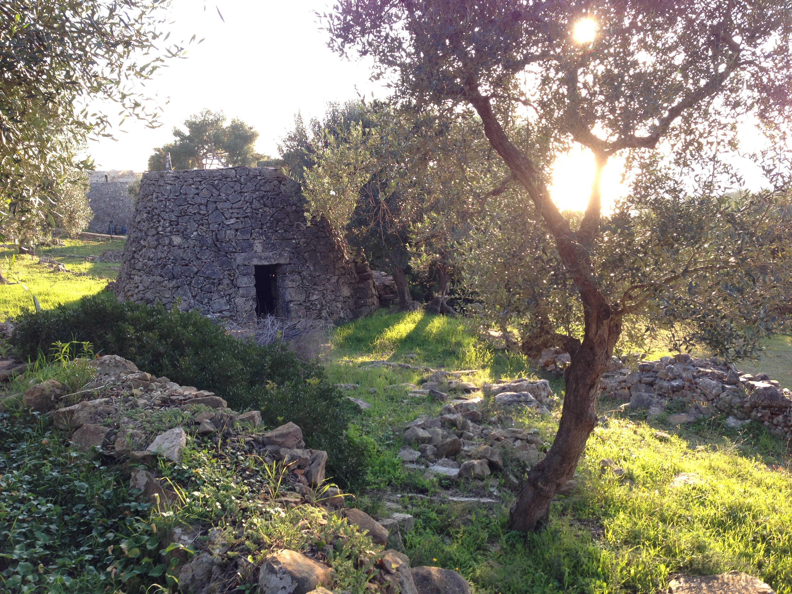
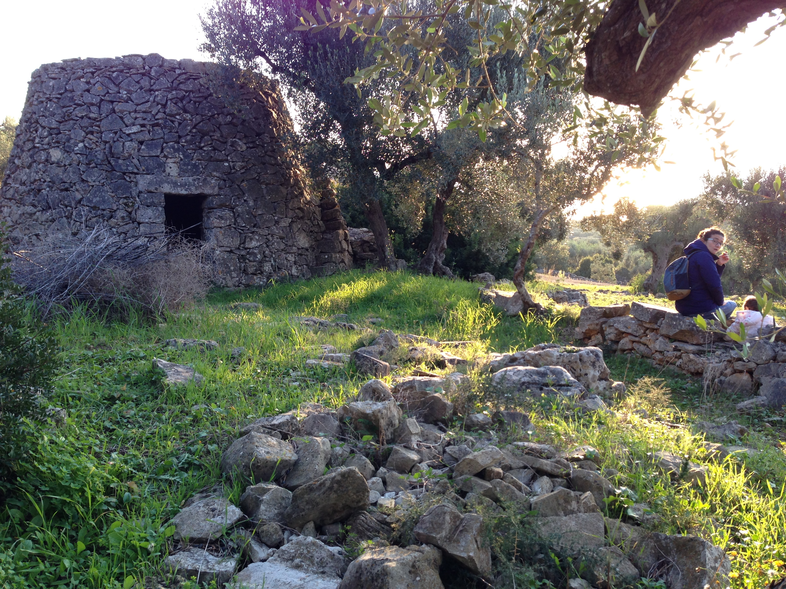

{:.images.fit}

__Paiara Pedone__ is surrounded by olive plantations growing on the south-facing ridge that runs along the Puglian peninsula.

It overlooks the bay of Feloniche, which is a quarter of a mile walk via a quiet pedestrian footpath. It is an equal distance to the other side of the peninsula where you will find the ancient port of San Gregorio.

{:.image.centre}

__Paiara Pedone__ is also just two-hundred yards from the There is a footpath called the 'sentiero vereto'

## le Grotte
Travel one mile south along the coast to Grotta del Drago and Grotta degli inammorati.

{:.image.centre}

## Punta Ristola/Leuca
Two miles to the south along the coast you will find _Punta Ristola_ and the town of Santa Maria de Leuca at the very tip of Italy's heel.

## Torre Vado
Travel one mile north along the coast and you will reach Torre Vado, an ancient fishing port with intact watch tower.

{:.image.centre}
