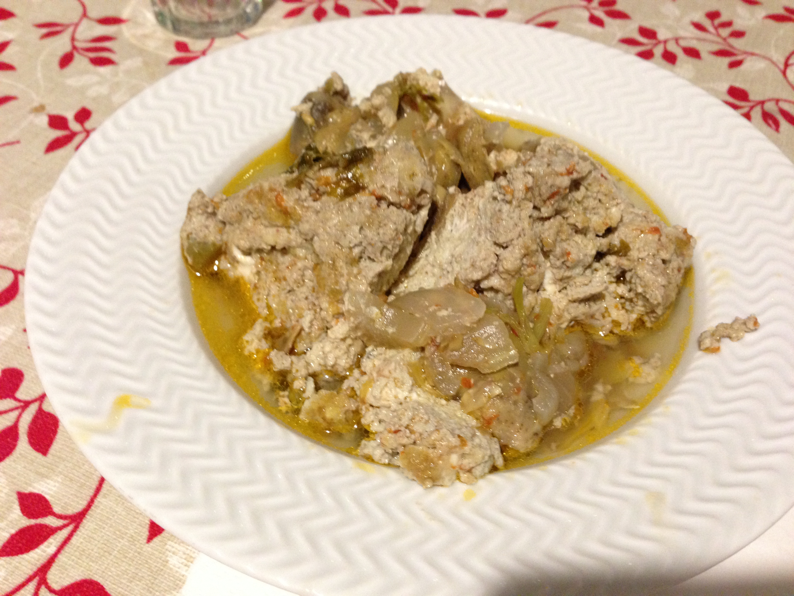
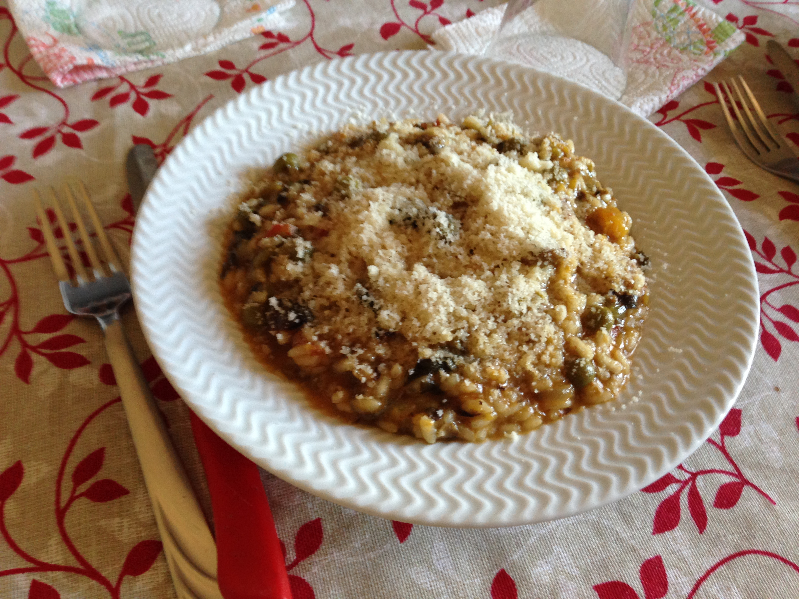

## Produzione Pedone

Food growing is a central part of Pedone family life. As well as keeping chickens, rabbits and pigs, they grow a wide variety of vegetables: 

## Pasta Pedone
As well as growing vegetables, the Pedones also grow their own grain using a traditional grain type called 'xxxx' which is difficult to buy. They take their grain to the mill and make home-made pasta using the flour. Nonno Pedone Kneeds the pasta while Nonna Pedone rolls and cuts into into strips. This type of pasta is called 'Massa'.

## Piatti Pedone
Nonna Pedone is very well versed in local cuisine. Here are some of the dishes she cooks on a regular basis:

### Fagioli
Fry some onion and celery in a saucepan, add some tomato sauce and then add the (cooked) white beans. Serve with bread and Parmesan cheese.
{:.image.centre}

### Wurze
Fry some cabbage in olive oil with sausages, add parmesan cheese.
{:.image.centre}

### Torta Karchoffi
Beat some eggs and add then add artichokes. Pour into pastry that has been rolled and cooked for 5 mins.
{:.image.centre}

### Risotto
Risotto comes in many flavours - this one is with vegetables and artichokes but others include: sausage, ham and mushroom.
{:.image.centre}

### Zabaione
The Pedones start the day with a 'zabaione' - egg yolk mixed with sugar and espresso. Although Nonno Pedone takes his egg yolk straigtht, without coffee.

{:.image.centre}

### Torta di Pera e Chocolata
Pear and chocolate cake: Recipe
{:.image.centre}
