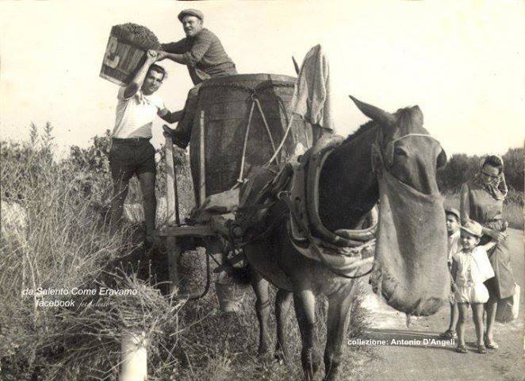
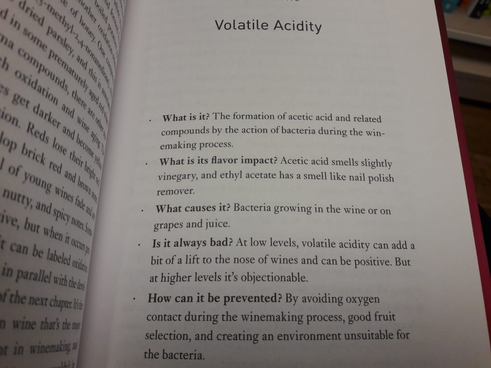
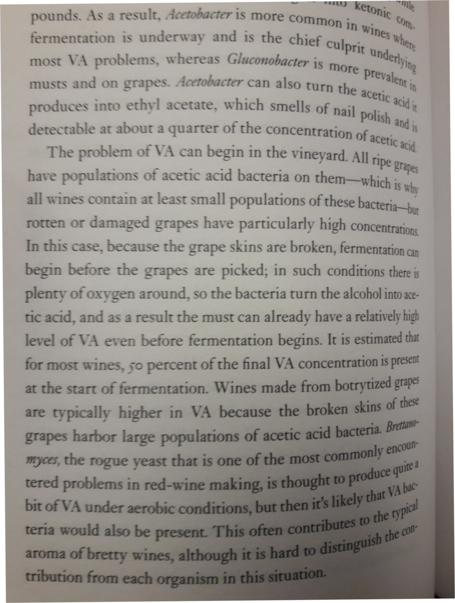
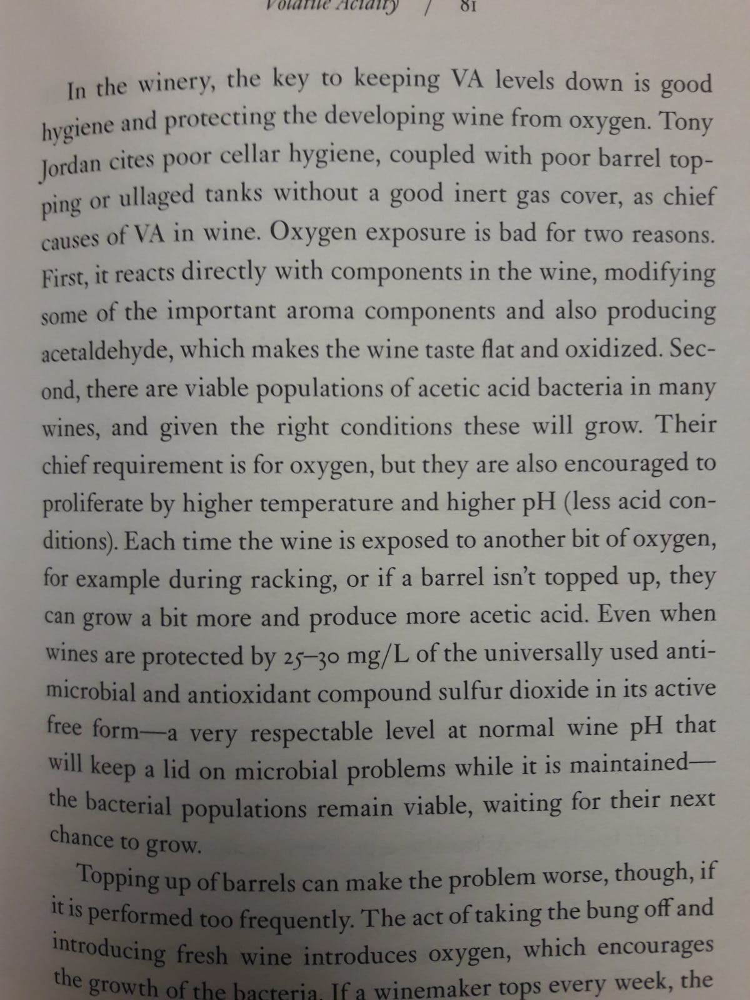
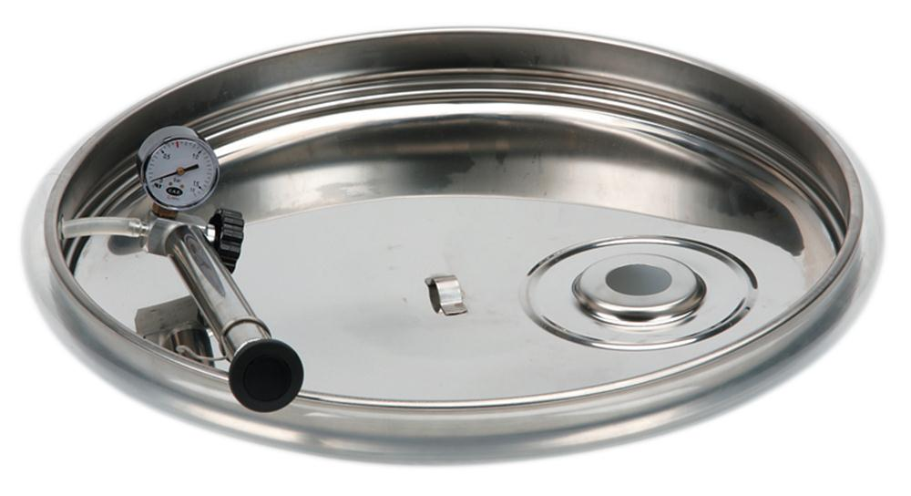

### Winemaking
In Puglia, almost 40% of the regional acreage under vine was devoted to native grapes as of 2010. The main red native grape varieties in Puglia are:

* Primitivo
* Negro Amaro
* Uva di Troia

White - Verdeca, Bianco d'Alessano, Pampanuto and Minutulo

Slightly rarer varieties:

* Susamaniello (mainly used as a blending grape)
* Ottavianello (a traditional variety of Puglia, elsewhere known as Cinsault)

Extinct but being revived varieties:

Marchione, Uva della Scala, Palumbo and Uva Attina. Antinello, Samarello Rosso, Cuccipanelli.

Extinct:
Pier Domenico, Tamiarello and Maricchione.

{:.image.centre}

## Suggestions

Discard rotten grapes..

Make sure correct amount of sulphur dioxide is added.

{:.image.centre}

{:.image.centre}

{:.image.centre}

Purchase a pneumatic sealing lid - a pump and sealing tube ensures that wine doesn't come into contact with oxygen.

{:.image.centre}

